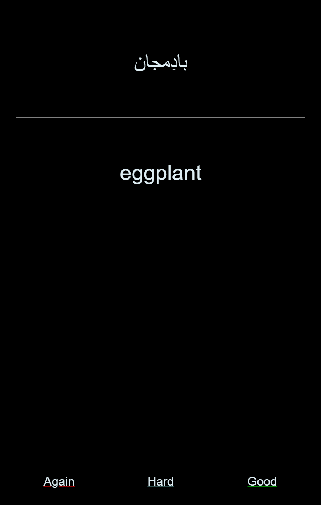
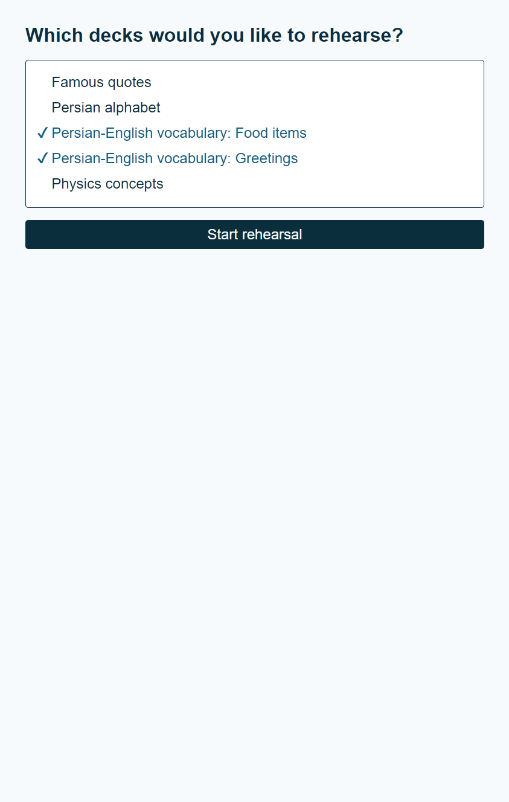
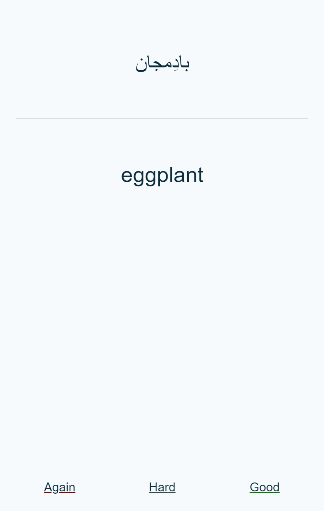

# Noctifer Flashcards

Noctifer Flashcards is a web-based flashcards application contained within a single file, using IndexedDB for persistent local storage and PHP/JavaScript for functionality.

The [live demo](https://flashcards.lrk.tools/demo) has two decks, showing unicode and audio support.

<p align="center">
       
</p>

## Features

* Simple setup with immediate functionality: Simply drop `index.php` into your webspace, point it to where the flashcard decks are stored, and you have everything you need to start learning.
* JSON-based decks: Decks are stored in single JSON files.
* Audio support: Both the front and back of cards can have corresponding audio, which will play automatically.
* Rich card formatting: Cards support bold, italic, and underlined formatting through BBCode.
* Keyboard shortcuts: The space bar and the numbers 1-3 can be used to reveal answers and indicate responses without using the mouse.
* Deck selection: Cards from any single deck, or any combination of decks, can be rehearsed in any given setting.
* Persistent storage and backup: Cards and card progress are stored locally using IndexedDB, and this information can be exported and imported.
* SM-2-based learning algorithm: A simplified version of SM-2 is used to track and update progress.
* Responsive design: Works on both desktop and mobile (note: mobile screens are detected based on their portrait orientation).
* Color schemes: Supports both light and dark themes, following system preference.


## Usage

### Installation and configuration

Simply drop `index.php` into your webspace. By default, it will look for deck files in `./decks`. This can be changed by adjusting the `$deckDirectory` variable at the top of `index.php` directly. This is also where a small number of additional parameters can optionally be changed, affecting the learning algorithm.


### Card and deck creation

Individual flashcards are stored in decks. A deck is represented by a single JSON file containing all of its cards as well as a header describing the deck. Each card has five properties: an ID, a front side, a back side, and audio to be played for the front and/or back side, respectively.

Take, for example, the _Persian greetings_ deck used in the demo, trimmed to its first two cards:


```json
{
    "header": {
        "name": "Persian greetings",
        "description": "Basic Persian greetings. Pronunciations by Forvo.",
        "allowDirectionChange": true
    },
    "cards": [
        {
            "id": "1",
            "front": "سَلام",
            "back": "hello",
            "audioFront": "/persian_greetings/سلام.mp3",
            "audioBack": "/persian_greetings/hello.mp3"
        },
        {
            "id": "2",
            "front": "خُداحافِظ",
            "back": "goodbye",
            "audioFront": "/persian_greetings/خداحافظ.mp3",
            "audioBack": "/persian_greetings/goodbye.mp3"
        }
    ]
}

```

The header's `name` property is shown at deck selection; `description` is currently not referenced but can be used for relevant information, such as licensing indicated here. `allowDirectionChange` indicates whether or not the cards should always be probed using their front side to the user, with the answer contained on the back side (`false`), or if it should be allowed to also show the back side furst for the user to then guess the corresponding front side (`true`).

For each card, `id`, `front`, and `back` are mandatory. `audioFront` and `audioBack` are optional. The root `/` here refers to the same directory that the deck JSON is in. `front` and `back` should contain just text, but support BBCode `[b]bold[/b]`, `[i]italic[/i]`, and `[underline]` for markup.


### Learning algorithm

The learning algorithm is a simplified version of [SM-2](https://en.wikipedia.org/wiki/SuperMemo#Description_of_SM-2_algorithm). The main differences are as follows.

* It only accepts 3 response types, rather than 6: 'Again' (incorrect, `quality = 0`), 'Hard' (correct but difficult, `quality = 3`), and 'Good' (correct, `quality = 5`).
* A novel word (i.e., `repetition = 0`) is always repeated at least once more in the same session regardless of answer (i.e., next `interval` is 10 minutes).
* After a novel word was correctly guessed (i.e., `repetition = 1`), it starts first with the default `interval` (by default 1 day). Only after the second correct repetition is `easeFactor` applied to `interval`.
* Since cards are only defined once and not separated into front-back and back-front notes, an additional direction change is implemented. After, by default, 3 correct repetitions, cards are switched from front-back to back-front, and the next review is scheduled after 1 day. After another 3 correct repetitions, front-back and back-front are both allowed and one is selected at random. 
